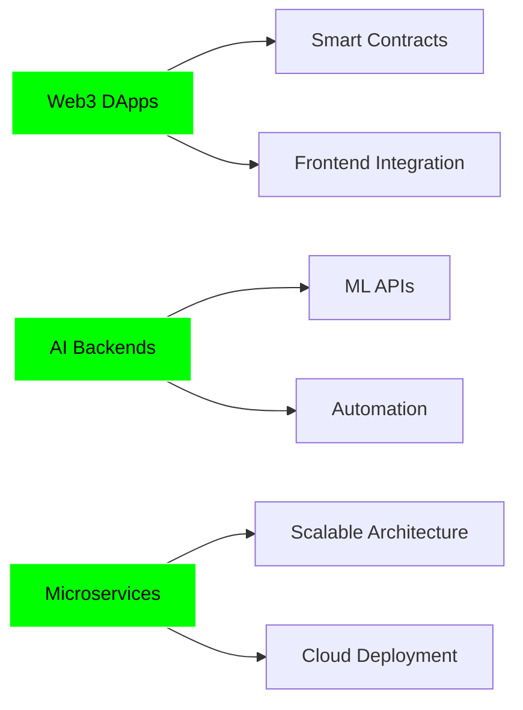

<div align="center">

<!-- Part 1: Animated Text -->
<a href="https://git.io/typing-svg">
  
</a>

<!-- Part 2: Skills Grid & Character Image -->
<table>
  <tr>
    <td width="60%">
      <table>
        <tr>
          <td width="50%">
            $\Large\color{red}{\underline{\textsf{Data\ \ Science}}}$
            <ul>
              <li>Data Analysis</li>
              <li>Data Visualization</li>
              <li>Data Management</li>
              <li>Dashboard Builder</li>
            </ul>
          </td>
          <td width="50%">
            $\Large\color{red}{\underline{\textsf{Web\ \ Development}}}$
            <ul>
              <li>Web App Development</li>
              <li>Portfolio Builder</li>
              <li>Small Business Dashboard</li>
            </ul>
          </td>
        </tr>
        <tr>
          <td>
            $\Large\color{red}{\underline{\textsf{Artificial\ \ Intelligence}}}$
            <ul>
              <li>Generative AI</li>
              <li>Chat Bots</li>
              <li>Business Automation</li>
            </ul>
          </td>
          <td>
            $\Large\color{red}{\underline{\textsf{Python\ \ Development}}}$
            <ul>
              <li>Python System Development</li>
              <li>OOP</li>
              <li>Data-Driven Projects</li>
            </ul>
          </td>
        </tr>
      </table>
    </td>
    <td width="40%" align="center">
      
    </td>
  </tr>
</table>

</div>

<hr>

## 🎓 About Me

<table>
  <tr>
    <td width="60%">
      <ul>
        <li>👨‍💻 <b>Data Science Student & Python Developer</b></li>
        <li>🌱 Learning <b>Full-Stack Development and Generative AI</b></li>
        <li>💻 Building <b>Portfolios with Web Languages and interactive dashboards with Power bi</b></li>
        <li>🧩 Passionate about <b>Backend systems, data analysis, and data management</b></li>
        <li>🖥️ Interested in <b>Web applications and Windows software</b></li>
        <li>🚀 <b>Exploring modern technologies and creating data-driven solutions</b></li>
        <li>🔬 Working on <b>data projects, dashboards, and backend architectures</b></li>
        <li>💬 Ask me about <b>Python, Data Science, Backend, Full-Stack, and AI</b></li>
        <li>⚙️ Fun fact: <b>I enjoy solving complex problems and optimizing systems</b></li>
        <li>✉ Reach me : <b><a href="mailto:wasifalibhatti12517@gmail.com">wasifalibhatti12517@gmail.com</a></b></li>
      </ul>
    </td>
    <td width="40%" align="center">
      
    </td>
  </tr>
</table>

---

<div align="center">

##  Technologies & Tools

<table>
  <tr>
    <td align="center" width="50%" valign="top">
      <h3>Technologies</h3>
      
      <h4>Programming Languages</h4>
      
      
      <h4>Frontend Development</h4>
      
      
      <h4>Backend Development</h4>
      
      
      <h4>AI & Data Science</h4>
      
      
      
      <br>
      
      
      
    </td>
    <td align="center" width="50%" valign="top">
      <h3>Tools</h3>
      
      <h4>DevOps & Tools</h4>
      
      
      
      <h4>Databases & Cloud</h4>
      
      
      <h4>Data Analysis Tools</h4>
      
      
      <br>
      
      
      
      <h4>Operating Systems</h4>
      
    </td>
  </tr>
</table>

</div>

---


---


## 🌐 Web3 & Blockchain

<div align="center">

| Technology | Experience |
|------------|------------|
| 🔗 **Smart Contracts** | Solidity, Hardhat, Truffle, OpenZeppelin |
| 🌐 **DApp Development** | React, Next.js, Web3.js, Ethers.js |
| ⛓️ **Blockchains** | Ethereum, Polygon, BSC, Arbitrum |
| 💎 **Projects** | DeFi Protocols, NFT Marketplaces, DAOs |
| 🔐 **Security** | Smart Contract Auditing, Best Practices |

</div>

---

## 🐍 Python Expertise

<div align="center">

```python
class majorskills:
    def __init__(self):
        self.automation = ["Web Scraping", "File Management", "Task Automation", "Script Maker"]
        self.data = ["Data Analysis", "NumPy", "Pandas", "Matplotlib", "Data Pipelines"]
        self.development = ["System Development", "Dashboards", "Chatbots"]
        self.integration = ["APIs", "Third-party Services"]
    
    def build_solutions(self):
        return "� Automating the boring stuff & building data-driven systems!"
```

</div>

---

## 🤖 Discord Bot Development

<table align="center">
  <tr>
    <td align="center" width="200">
      
      <br><b>Python Bots</b>
      <br>Discord.py
    </td>
    <td align="center" width="200">
      
      <br><b>JS Bots</b>
      <br>Discord.js
    </td>
    <td align="center" width="200">
      
      <br><b>TS Bots</b>
      <br>Type-safe
    </td>
  </tr>
</table>

**Features I Build:**
- 🛡️ Advanced Moderation Systems
- 🎵 Music & Entertainment
- 👋 Welcome & Auto-responses
- 📊 Analytics & Logging
- 🎮 Game Integrations
- 🤖 AI-powered Responses

---

## 🚧 Current Focus

<div align="center">



</div>

> 🔒 Many of my contributions are in **private repositories**  
> 🚀 Currently building: Web3 DApps, AI-powered backends, scalable microservices

---

## 🌐 Connect with Me

<div align="center">

[](https://linkedin.com/in/hozaifa-ali)
[](https://twitter.com/hozaifa095)
[](https://discord.com/users/1222455872668827669)
[](mailto:hozaifaa095@gmail.com)
[](https://github.com/hozi8-web3)
[](https://hozi8-web3.github.io)

</div>

---

## 📈 Contribution Graph

<div align="center">
  
</div>

---

## 💡 Quote of the Day

<div align="center">

```diff
+ "The best way to predict the future is to implement it."
```

**— David Heinemeier Hansson**

</div>

---

<div align="center">

### 🐍 Contribution Snake

<picture>
  <source media="(prefers-color-scheme: dark)" srcset="https://raw.githubusercontent.com/hozi8-web3/hozi8-web3/output/github-contribution-grid-snake-dark.svg">
  <source media="(prefers-color-scheme: light)" srcset="https://raw.githubusercontent.com/hozi8-web3/hozi8-web3/output/github-contribution-grid-snake.svg">
  
</picture>

</div>

---

<div align="center">
  
### 💚 Show some love by starring my repositories! 💚


**Made with ❤️ by HOZI**

</div>
